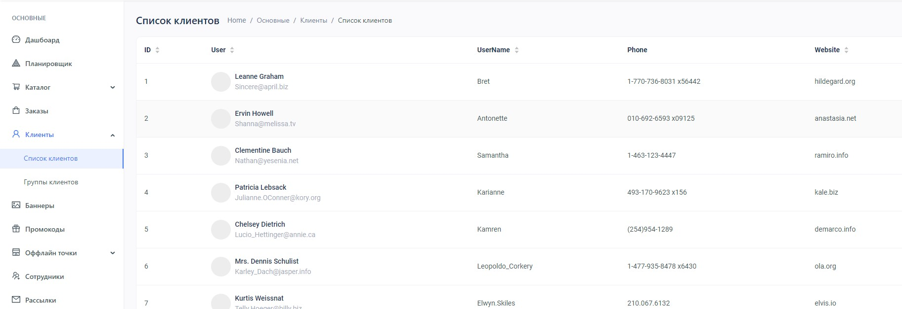

# Тестовое задание для Hammer Systems

### Часть 1

●   Необходимо реализовать боковое меню с разделами, аналогично тому, что изображено на картинке ниже

●   В раздел Клиенты -> Список клиентов перенести реализацию страницы Pages -> User list из демо проекта. Данные о пользователях получать по api https://jsonplaceholder.typicode.com . Столбцы из демо можно заменить на свои(на те поля которые приходят в апи)

●   Пока данные загружаются на экране должен крутиться лоадер

●   При нажатии на пользователя открывать страницу аналогичную странице в демо Pages -> Setting (только вкладка Edit Profile). Подставить данные выбранного пользователя. Поля также можно поменять на подходящие

●   При нажатии на Save Changes имитировать отправку данных на сервер, покрутить секунду лоадер и вернуться обратно на список пользователей

●   Задеплоить в сеть, например на heroku 

#### Результат:

### *Часть 2*

Реализовать простой 2д планировщик:

●   Сделать блок со списком объектов на выбор(это могут быть 2д фотографии столов, стульев, перегородок)

●   Сделать доску на которое можно добавлять эти объекты и перемещать их мышкой

●   Должна быть возможность сохранения расстановки в файл(сохранять id объекта и его координаты)

●   Также должна быть возможность импорта этого файла с координатами и отображения сохраненной расстановки

#### Результат:

